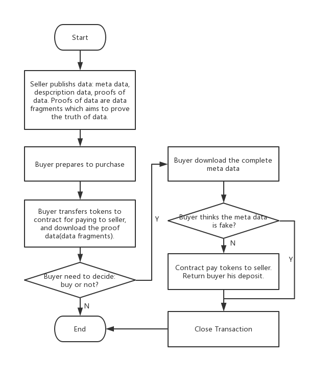

[中文](./ScryInfo协议层SDK接口文档v0.0.5.md)  
[EN](./ScryInfo%20protocol%20layer%20SDK%20%20v0.0.5.md)  
---
title: ScryInfo protocol layer SDK API documents  v0.0.5  
tags: v0.0.5  
grammar_cjkRuby: true  
---
### Scry protocol layer process



### API
#### Sdk
Package: sdk

|seq|definition|functionality|
|:-------|:-------|:-------|
|1|Init(<br/>ethNodeAddr string,<br/>keyServiceAddr string,<br/>protocolAddr string,<br/>tokenAddr string,<br/>fromBlock uint64,<br/>ipfsNodeAddr string,<br/>) error|Before using scryinfo protocol layer SDK you need to initialize all SDK<br/>ethNodeAddr: Eth node address<br/>keyServiceAddr: Key service address<br/> protocolAddr: Protocol contract address<br/>tokenAddr: token address<br/>fromBlock: event scan origin block, default setting is 0<br/>ipfsNodeAddr: IPFSnodeaddress

##### ScryClient
Package: sdk/scryclient

|seq|definition|functionality|
|:-------|:-------|:-------|
|1|CreateScryClient(password string) (*ScryClient, error)|After API deployment success,a ScryClient will be created(such as named scryClient), including public&private key account or creator, private key will be stored after encryption<br/>User can get account address after visiting scryClient.Account.Address <br/><br/>password: The password of account to be created, please keep carefully
|2|SubscribeEvent(eventName string, callback chainevents.EventCallback)|ScryClient can order certain event on chain by deploying this API When event comes it will trigger certain callback function. Event format can be ordered is:<br/><br/>DataPublish<br/>TransactionCreate<br/>Buy<br/>ReadyForDownload<br/>TransactionClose<br/>Approval
|3|Authenticate(password string) (bool, error)|Verify user password is correct or not <br/><br/>password: Password to be verified
|4|TransferEthFrom(from common.Address, password string, value *big.Int) error|Transfer ETH from address called “from” to this client<br/><br/>from: Origin account<br/>password: Origin account password<br/> value: Amount to be transferred, unit: 1 wei
|5|TransferTokenFrom(from common.Address, password string, value *big.Int) error|Transfer Token from address called “from” to this client<br/><br/>from: Origin account<br/>password: origin account password, used for transaction signature <br/>value: Amount to be transferred, unit: 1 token
|6|GetEth(owner common.Address) (*big.Int, error)|Get ETH amount from account address called owner, unit: 1 wei <br/><br/>owner: account address
|7|GetScryToken(owner common.Address) (*big.Int, error)|Get Token amount from from account address called owner, unit:1 token<br/><br/>owner: account address

##### Contract
Package: sdk/scryclient/chaininterfacewrapper

|seq|definition|functionality|
|:-------|:-------|:-------|
|1|Publish(<br/>txParams *op.TransactParams,<br/>price *big.Int,<br/>metaData []byte,<br/>proofDatas [][]byte,<br/>proofNum int,<br/>descriptionData []byte<br/>) (string, error)|Publish data to IPFS and store source id returned from IPFS in blockchain contracts<br/><br/>The first return value from this API is publishId，type is string<br/>txParams:blockchain transaction parameters<br/>price:  data price, unit: 1 t oken <br/>metaData: Data to be sold<br/>proofDatas: proof of data piece to verify data authentication<br/>proofNum: Array size of proof of data piece<br/>descriptionData : Data description, such as title, keyword etc. Specified meaning should be decided by application layer<br/><br/>When all data is published to IPFS and blockchain , it will send DataPublish event to all users.<br/>DataPublish event is transmitted with Json format, please refer to Event API
|2|ApproveTransfer(txParams *op.TransactParams,spender common.Address, value *big.Int) error|Admit address spender transfer token from deployment address of this API<br/><br/>txParams   :Blockchain transaction parameters<br/>spender    : Transfer admitted origin address<br/>value      :Transfer amount admitted, unit:1 token, should be higher than/equal to data to be purchased<br/><br/>In this process, chain will send Approval event to deployer after getting request,please refer to Event API
|3|PrepareToBuy(txParams *op.TransactParams,publishId string) error|Buyers are ready to buy data and hope to get data verification ID <br/>Before deploying this API, buyers should deploy ApproveTransfer API first and admit contract transfer mortagage from buyers address<br/><br/>txParams   : Blockchain transaction parameter <br/>publishId   : Same as above<br/><br/>Chain will send TransactionCreate event to buyers after getting request TransactionCreate event is transmitted with Json format, please refer to Event API
|4|BuyData(txParams *op.TransactParams,txId *big.Int)error|Buyers buy data<br/><br/>txParams   : Blockchain transaction parameters<br/>txId: : Transaction ID this time, obtained from transactionId array in TransactionCreate event<br/><br/>Chain will sent Buy event to sellers after getting request<br/>Buy event is transmitted with Json format, please refer to Event API
|5|SubmitMetaDataIdEncWithBuyer(txParams *op.TransactParams, txId *big.Int, encyptedMetaDataId []byte) error|Sellers upload metaDataId of data to be purchased, this ID is encrypted with buyers public key<br/><br/>txParams: Blockchain transaction parameters<br/>txId: transaction ID this time, obtained from transactionId array in Buy event<br/>encyptedMetaDataId: metaDataId encrypted with buyers public key <br/><br/>Chain will send ReadyForDownload event to buyers after getting request<br/>Buyers get metaDataId and decrypted with private key, then get the real meta data ID，can download data from IPFS<br/>ReadyForDownload event is transmitted with Json format, please refer to Event API
|6|ConfirmDataTruth(txParams *op.TransactParams, txId *big.Int, truth bool) error|Buyers confirm data authentication<br/><br/>txParams: Blockchain transaction parameters<br/>txId: Transaction ID this time, obtained from transactionId in Buy event<br/>truth:Whether the data is ture or not<br/><br/>Chain will send TransactionClose event to all users after getting the request and then end the transaction<br/>If the data is true, contract will send the mortagage from buyers to sellers<br/>TransactionClose event is transmitted with Json format, please refer to Event API

##### Key Manager
Package: sdk/util/accounts

|seq|definition|functionality|
|:-------|:-------|:-------|
|1|Encrypt(plainText []byte, address string) ([]byte, error)|Encrypt plaintext with the public key of user address <br/><br/>plainText: plaintext data<br/>address: user address
|2|Decrypt(cipherText []byte, address string, password string) ([]byte, error)|Decrypt the ciphertext with the private key of user’s address<br/><br/>cipherText: cipher text <br/>address: user address <br/>password: user password
|3|ReEncrypt(cipherText []byte, address1, address2, password string) ([]byte, error)|The encrypted data cipherText is decrypted and then encrypted using the public key of the second user address.<br/><br/>cipherText: ciphertext data <br/>address1: decrypt user address <br/>address2: encrypted user address<br/>password: decrypt user password

##### Event
All events are transmitted in JSON format.

|seq|definition|functionality|
|:-------|:-------|:-------|
|1|DataPublish|{<br/>"despDataId": "QmhKnroYBFp", //Data description ID, based on wich the description of the data for sale can be obtained from IPFS<br/>"price": 1000,//Price for sale<br/>"publishId": "155212056", //the released ID is the same as the first return value of Publish<br/>"seqNo": "155212057",<br/>"users": "[0xxxx]"<br/>}
|2|Approval|{<br/>"owner": "0x3Ab0dAA324", //authorized person<br/>"spender": "0x3c4d26E91", // authorized pperson<br/>"value": 1600 //has been granted<br/>}
|3|TransactionCreate|{<br/>"proofIds":[[211, 159], [170, 49]], //data proof ID<br/>"publishId": "1552121",<br/>"seqNo": "15521219",<br/>"transactionId": 4, //transaction ID<br/>"users":["0xxxx"]<br/>}
|4|Buy|{<br/>"metaDataIdEncSeller": "SdWeLSqpSyhGA==", //Metadata ID encrypted with the seller's public key<br/>"publishId": "1552121827295982593-913139", //Data release ID<br/>"seqNo": "1552121924035218179-67679122","transactionId": 4, //Transaction ID<br/>"users": ["0xxxx"]<br/>}
|5|ReadyForDownload|{<br/>"metaDataIdEncBuyer": "tql/mAZY/z0aR2g==", //Metadata ID encrypted with the buyer’s public key<br/>"seqNo": "1552126832692923242-89400636",<br/>"transactionId": 4, //Transaction ID<br/>"users":["0xxxx"]<br/>}
|6|TransactionClose|{<br/>"seqNo": "1552126873209063970-5512851552272651527",<br/>"transactionId": 4, //Transaction ID<br/>"users": ["0xxxx"]<br/>}

### Routine

##### First step to deploy SDK: SDK initialization
``` golang
func main() {	
	wd, _ := os.Getwd()
	err := sdk.Init(
	    "http://192.168.1.12:8545/",
	    "192.168.1.6:48080",
	    protocolContractAddr,
	    tokenContractAddr,
	    0,
	    "/ip4/192.168.1.6/tcp/5001",
	    wd+"/testconsole.log",
	    "scryapp1")
		
	......
}
```

##### Second step: Create general account, transfer Eth and token from super account to this account for transaction
The system has a built-in super account. The account address and password are shown in the example code Normal accounts need to consume gas and token for trading, so users must first transfer from super account to ETH and token

``` golang
seller := scryclient.NewScryClient(address)
buyer := scryclient.NewScryClient(address)

// subscribe events
seller.SubscribeEvent("DataPublish", onPublish)
seller.SubscribeEvent("Buy", onPurchase)
seller.SubscribeEvent("TransactionCreate", onTransactionCreate)
seller.SubscribeEvent("TransactionClose", onClose)

// Approve success if buyer received onApprovalBuyerTransfer notification
buyer.SubscribeEvent("Approval", onApprovalBuyerTransfer)
buyer.SubscribeEvent("TransactionCreate", onTransactionCreate)
buyer.SubscribeEvent("ReadyForDownload", onReadyForDownload)
buyer.SubscribeEvent("TransactionClose", onClose)
```

##### Now we can start transaction 
###### Sellers publish data
``` golang
func SellerPublishData(supportVerify bool) {


	//pending metadata
	metaData := []byte("magic meta data test")
	//some metadata fragments: used to prove the authenticity of metadata
	proofData := [][]byte{{'4', '5', '6', '3'}, {'2', '2', '1'}}
	//metadata description data 
	despData := []byte{'7', '8', '9', '3'}

	txParam := chainoperations.TransactParams{
	    From: common.HexToAddress(seller.Account.Address),
	    Password: keyPassword,
    }

	cif.Publish(
	    &txParam,
	    big.NewInt(1000),
	    metaData,
	    proofData,
	    2,
	    despData,
	)
}
```
###### Buyers get data publish notification and description ID for this data, then they can download data description info from IPFS
``` golang
func onPublish(event events.Event) bool {
    //data release ID
	publishId = event.Data.Get("publishId").(string)
	//description data ID
	despDataId := event.Data.Get("despDataId").(string)
	//price
	price := event.Data.Get("price").(*big.Int)
	return true
}
```

###### Buyers are interested in this data after seeing description info,then they set mortagage amount and admit smart contract transfer Token from their account for mortagage
``` golang
func BuyerApproveTransfer() {   

    //buyerPassword: the account password of buyer 
    txParam := chainoperations.TransactParams{
        From: common.HexToAddress(buyer.Account.Address),
        Password: buyerPassword,
    }
	
	//protocolContractAddr is the protocol layer contract address
	//the amount of the deposit must be greater than or equal to the data price, otherwise the purchase operation will fail
	err := cif.ApproveTransfer(&txParam,
	    common.HexToAddress(protocolContractAddr),
	    big.NewInt(1000))
		
	if err != nil {
		fmt.Println("BuyerApproveTransfer:", err)
	}
}
```


###### Buyers are ready to buy it, smart contract deducts mortagage from buyers account
``` golang
func PrepareToBuy(publishId string) {
    txParam := chainoperations.TransactParams{
        From: common.HexToAddress(buyer.Account.Address),
        Password: buyPassword,
    }
	
	err := cif.PrepareToBuy(&txParam, publishId)
	if err != nil {
		fmt.Println("failed to prepareToBuy, error:", err)
	}
}
```

###### Buyer get transaction id
``` golang
func onTransactionCreate(event events.Event) bool {
    fmt.Println("seller: onTransactionCreated:", event)
	
	//transaction ID
    txId = event.Data.Get("transactionId").(*big.Int)

    return true
}
```

###### Buyers get data verification ID and they can download data verification results from IPFS with this ID to judge whether this data is exactly what they want

``` golang

func onTransactionCreate(event events.Event) bool {
    //transaction ID
	txId = event.Data.Get("transactionId").(*big.Int)
	
	//proof IDs
    proofIDs := event.Data.Get("proofIds").([][32]byte)

	return true
}

```


###### Buyers decide to buy data

``` golang
func Buy(txId *big.Int) {
    //the seller needs to order the Buy event in order to receive the buyer’s purchase
	seller.SubscribeEvent("Buy", onPurchase)

    //buyerPassword is the account password of the buyer 
    txParam := chainoperations.TransactParams{
        From: common.HexToAddress(buyer.Account.Address),
        Password: buyerPassword,
    }
	
	//txId is transaction ID
	err := cif.BuyData(&txParam, txId)
	
	if err != nil {
		fmt.Println("failed to buyData, error:", err)
	}
}
```

###### Sellers get notifications of data transaction and generate meta data id encrypted with buyers public key, then send it to contract

``` golang
func onPurchase(event events.Event) bool {
	fmt.Println("onPurchase:", event)
	
	//meta data is encrypted with the seller’s public key
	metaDataIdEncWithSeller = event.Data.Get("metaDataIdEncSeller").([]byte)
	//buyer address
	buyerAddr := event.Data.Get("buyer").(common.Address)

	var err error
	//metaDataIdEncWithBuyer： meta data is encrypted with the buyer’s public key
	//metaDataIdEncWithSeller: meta data is encrypted with the seller’s public key
	//sellerPassword: seller password
    metaDataIdEncWithBuyer, err = accounts.GetAMInstance().ReEncrypt(
        metaDataIdEncWithSeller,
        seller.Account.Address,
        buyerAddr.String(),
        clientPassword,
    )

    if err != nil {
        fmt.Println("failed to ReEncrypt meta data id with buyer's public key")
        return false
    }

    SubmitMetaDataIdEncWithBuyer(txId)
	return true
}


func SubmitMetaDataIdEncWithBuyer(txId *big.Int) {
    //the buyer needs to monitor to the ReadyForDownload event
    txParam := chainoperations.TransactParams{
        From: common.HexToAddress(seller.Account.Address),
        Password: sellerPassword,
    }
	
	err := cif.SubmitMetaDataIdEncWithBuyer(
	    &txParam,
	    txId,
	    metaDataIdEncWithBuyer)
	if err != nil {
		fmt.Println("failed to SubmitMetaDataIdEncWithBuyer, error:", err)
	}
}
```

###### Buyers get meta data id and can download full data from IPFS
``` golang
func onReadyForDownload(event events.Event) bool {
	metaDataIdEncWithBuyer = event.Data.Get("metaDataIdEncBuyer").([]byte)

    //buyer to decrypt metaDataIdEncWithBuyer，get original meta data id, download 
	metaDataId, err := accounts.GetAMInstance().Decrypt(
	    metaDataIdEncWithBuyer,
	    buyer.Account.Address,
	    buyerPassword)

    if err != nil {
        fmt.Println("failed to decrypt meta data id with buyer's private key", err)
        return false
    }
    
	return true
}
```

###### Buyers give feedbacks about data authentication

``` golang
func ConfirmDataTruth(txId *big.Int) {
	buyer.SubscribeEvent("TransactionClose", onClose)

    txParam := chainoperations.TransactParams{
        From: common.HexToAddress(buyer.Account.Address),
        Password: buyerPassword,
    }
	
	//txId: transaction ID
	err := cif.ConfirmDataTruth(
	    &txParam,
	    txId,
	    true)
	if err != nil {
		fmt.Println("failed to ConfirmDataTruth, error:", err)
	}
}
```

###### Transaction end notification
``` golang
func onClose(event events.Event) bool {
	fmt.Println("onClose:", event)
	return true
}
```

