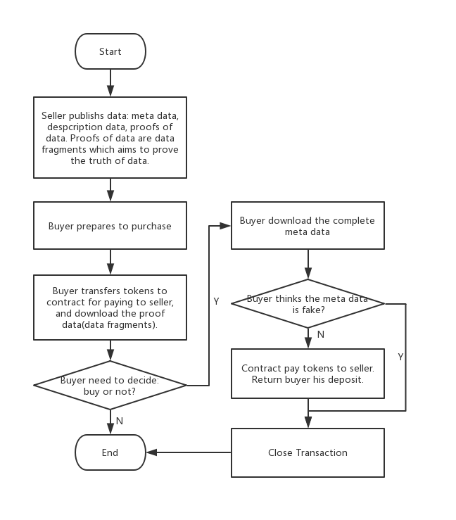

[中文](./ScryInfo协议层SDK接口文档v0.0.5.md)  
[EN](./ScryInfo%20protocol%20layer%20SDK%20%20v0.0.5.md)  
---
title: ScryInfo 协议层SDK接口文档 v0.0.5  
tags: v0.0.5  
grammar_cjkRuby: true  
---
### Scry协议层业务流程



### 接口
##### Sdk 
Package: sdk

|seq|definition|functionality|
|:-------|:-------|:-------|
|1|Init(<br/> ethNodeAddr string,<br/>keyServiceAddr string,<br/>protocolAddr string,<br/>tokenAddr string,<br/>fromBlock uint64,<br/>ipfsNodeAddr string,<br/>) error|在使⽤scryinfo协议层SDK之前，需要对整个SDK进⾏初始化。<br/>ethNodeAddr: 以太坊节点地址。<br/>keyServiceAddr: 密钥服务地址<br/> protocolAddr: 协议智能合约的地址<br/>tokenAddr: token智能合约的地址<br/>fromBlock: event扫描的起始区块，一般默认为0<br/>ipfsNodeAddr: IPFS节点地址

##### ScryClient - Scry客户端操作
Package: sdk/scryclient

|seq|definition|functionality|
|:-------|:-------|:-------|
|1|CreateScryClient(password string) (*ScryClient, error)|接口调用成功后，会创建⼀个ScryClient实例(如名为scryClient)，包括创建用户的公私钥账户，私钥经加密后保存。<br/>⽤户访问scryClient.Account.Address能够得到⽤户的账户地址。<br/><br/>password: 待创建账户的密码，请牢记
|2|SubscribeEvent(eventName string, callback chainevents.EventCallback)|当前ScryClient通过调用此接口，可订购链上此用户的指定事件（event）。当event到来时，会触发指定的callback函数，可以订购的event有：<br/><br/>DataPublish<br/>TransactionCreate<br/>Buy<br/>ReadyForDownload<br/>TransactionClose<br/>Approval
|3|Authenticate(password string) (bool, error)|验证用户密码是否正确<br/><br/>password: 待验证密码
|4|TransferEthFrom(from common.Address, password string, value *big.Int) error|从地址为from的账户向本client账户进行ETH转账。<br/><br/>from: 源账户<br/>password: 源账户密码<br/> value: 待转账数额，单位为 1 wei
|5|TransferTokenFrom(from common.Address, password string, value *big.Int) error|从地址为from的账户向本client账户进行Token转账。<br/><br/>from: 源账户<br/>password: 源账户密码，用作交易签名<br/>value: 待转账数额，单位为 1 token
|6|GetEth(owner common.Address) (*big.Int, error)|获取账户地址为owner的ETH数额，单位为wei。<br/><br/>owner: 账户地址
|7|GetScryToken(owner common.Address) (*big.Int, error)|获取账户地址为owner的Token数额，单位为 1 token。<br/><br/>owner: 账户地址

##### Contract - 合约操作
Package: sdk/scryclient/chaininterfacewrapper

|seq|definition|functionality|
|:-------|:-------|:-------|
|1|Publish(<br/>txParams *op.TransactParams,<br/>price *big.Int,<br/>metaData []byte,<br/>proofDatas [][]byte,<br/>proofNum int,<br/>descriptionData []byte<br/>) (string, error)|发布数据到IPFS上，并将IPFS返回的资源id保存到区块链合约中。<br/><br/>该接⼝第⼀个返回值为publishId，类型为string。<br/>txParams      : 区块链交易参数。<br/>price          : 数据售价，单位为1 token<br/>metaData      : 待售数据<br/>proofDatas     : 数据证明⽚段，⽤来证明所发布的数据的真实性 proofNum      : 数据证明⽚段的数组⼤⼩<br/>descriptionData : 数据描述，如title, keyword等。具体意义由应⽤层决定。<br/><br/>当数据成功发布到IPFS和区块链上，链会发送DataPublish事件给所有⽤户。<br/>DataPublish事件以Json格式定义，参见Event接⼝
|2|ApproveTransfer(txParams *op.TransactParams,spender common.Address, value *big.Int) error|准许地址spender从本接⼝调⽤⽅地址进⾏token转账，<br/><br/>txParams   : 区块链交易参数<br/>spender    : 被允许的转账发起地址<br/>value      : 被允许的转账额度, 单位为1 token，要⼤于或等于想购买的数据价格<br/><br/>在这个过程中，链收到请求后，会发送Approval事件给调⽤⽅。参见Event接⼝。
|3|PrepareToBuy(txParams *op.TransactParams,publishId string) error|买⽅准备购买数据，希望得到待买数据的证明数据ID。<br/>在调⽤本接⼝之前，买⽅需先调⽤ApproveTransfer接⼝，允许合约从买⽅地址转出押⾦。<br/><br/>txParams   : 区块链交易参数<br/>publishId   : 同上<br/><br/>链收到请求后，会发送TransactionCreate事件给买⽅。 TransactionCreate事件以Json格式定义，参见Event接⼝。
|4|BuyData(txParams *op.TransactParams,txId *big.Int)error|买⽅正式购买数据。<br/><br/>txParams   : 区块链交易参数<br/>txId: : 本次交易ID，由TransactionCreate事件的transactionId字段取得。<br/><br/>链收到请求后，会发送Buy事件给卖方<br/>Buy事件以Json格式定义，参见Event接口
|5|SubmitMetaDataIdEncWithBuyer(txParams *op.TransactParams, txId *big.Int, encyptedMetaDataId []byte) error|卖方上传待售数据的metaDataId到区块链上，该ID使用买方公钥加密。<br/><br/>txParams: 区块链交易参数<br/>txId: 本次交易ID，由Buy事件的transactionId字段取得<br/>encyptedMetaDataId: 使用买方公钥加密的metaDataId<br/><br/>链收到请求后，会发送ReadyForDownload事件给买方。<br/>买方得到metaDataId并用私钥解密，得到真正的meta data ID，就可以从IPFS上下载数据了。<br/>ReadyForDownload事件以Json格式定义，参见Event接口。
|6|ConfirmDataTruth(txParams *op.TransactParams, txId *big.Int, truth bool) error|买方确认数据真实性。<br/><br/>txParams: 区块链交易参数<br/>txId: 本次交易ID，由Buy事件的transactionId字段取得<br/>truth: 数据是否真实<br/><br/>链收到请求后，会发送TransactionClose事件给所有用户，并关闭交易。<br/>若数据为真，合约会将买方押金支付给卖方。<br/>TransactionClose事件以Json格式定义，参见Event接口。

##### Key Manager - 密钥管理接口
Package: sdk/util/accounts

|seq|definition|functionality|
|:-------|:-------|:-------|
|1|Encrypt(plainText []byte, address string) ([]byte, error)|使用用户地址为address的公钥对明文plainText进行加密<br/><br/>plainText: 明文数据<br/>address: 用户地址
|2|Decrypt(cipherText []byte, address string, password string) ([]byte, error)|使用用户地址为address的私钥对密文cipherText进行解密<br/><br/>cipherText: 密文<br/>address: 用户地址<br/>password: 用户密码
|3|ReEncrypt(cipherText []byte, address1, address2, password string) ([]byte, error)|对已加密数据cipherText进行解密，然后在使用第二个用户地址的公钥进行加密。<br/><br/>cipherText: 密文数据<br/>address1: 解密用户地址<br/>address2: 加密用户地址<br/>password: 解密用户密码

##### Event - 合约事件
所有的Event都以JSON格式进行传输。

|seq|definition|functionality|
|:-------|:-------|:-------|
|1|DataPublish|{<br/>"despDataId": "QmhKnroYBFp", //数据描述ID，可以从IPFS取得待售数据的描述<br/>"price": 1000,// 待售数据价格<br/>"publishId": "155212056", //本次发布的ID，与Publish()第一个返回值相同<br/>"seqNo": "155212057",<br/>"users": "[0xxxx]"<br/>}
|2|Approval|{<br/>"owner": "0x3Ab0dAA324", //授权人<br/>"spender": "0x3c4d26E91", //被授权人<br/>"value": 1600 //授权额度<br/>}
|3|TransactionCreate|{<br/>"proofIds":[[211, 159], [170, 49]], //证明数据ID<br/>"publishId": "1552121", // 数据发布ID<br/>"seqNo": "15521219",<br/>"transactionId": 4, //本次交易ID<br/>"users":["0xxxx"]<br/>}
|4|Buy|{<br/>"metaDataIdEncSeller": "SdWeLSqpSyhGA==", //使用卖方公钥加密的元数据ID<br/>"publishId": "1552121827295982593-913139", //数据发布ID<br/>"seqNo": "1552121924035218179-67679122","transactionId": 4, //本次交易ID<br/>"users": ["0xxxx"]<br/>}
|5|ReadyForDownload|{<br/>"metaDataIdEncBuyer": "tql/mAZY/z0aR2g==", //使用买方公钥加密的元数据ID<br/>"seqNo": "1552126832692923242-89400636",<br/>"transactionId": 4, //本次交易ID<br/>"users":["0xxxx"]<br/>}
|6|TransactionClose|{<br/>"seqNo": "1552126873209063970-5512851552272651527",<br/>"transactionId": 4, //本次交易ID<br/>"users": ["0xxxx"]<br/>}

### 例程

##### 调用SDK的第一步：初始化SDK
``` golang
func main() {	
	wd, _ := os.Getwd()
	err := sdk.Init(
	    "http://192.168.1.12:8545/",
	    "192.168.1.6:48080",
	    protocolContractAddr,
	    tokenContractAddr,
	    0,
	    "/ip4/192.168.1.6/tcp/5001",
	    wd+"/testconsole.log",
	    "scryapp1")
		
	......
}
```

##### 第二步：创建用户实例
系统预先生成了用户账户，该账户内包含ETH和token，到时候会分配给各团队
用户需要根据分配的账户地址生成用户实例。

``` golang
seller := scryclient.NewScryClient(address)
buyer := scryclient.NewScryClient(address)

//订购事件
seller.SubscribeEvent("DataPublish", onPublish)
seller.SubscribeEvent("Buy", onPurchase)
seller.SubscribeEvent("TransactionCreate", onTransactionCreate)
seller.SubscribeEvent("TransactionClose", onClose)

//买方若收到onApprovalBuyerTransfer通知，表明approve成功
buyer.SubscribeEvent("Approval", onApprovalBuyerTransfer)
buyer.SubscribeEvent("TransactionCreate", onTransactionCreate)
buyer.SubscribeEvent("ReadyForDownload", onReadyForDownload)
buyer.SubscribeEvent("TransactionClose", onClose)
```

##### 下面可以开始交易了
###### 卖方发布数据
``` golang
func SellerPublishData(supportVerify bool) {


	//待发布的元数据
	metaData := []byte("magic meta data test")
	//一些元数据片段: 用以证明元数据的真实性
	proofData := [][]byte{{'4', '5', '6', '3'}, {'2', '2', '1'}}
	//元数据的描述数据
	despData := []byte{'7', '8', '9', '3'}

	txParam := chainoperations.TransactParams{
	    From: common.HexToAddress(seller.Account.Address),
	    Password: keyPassword,
    }

	cif.Publish(
	    &txParam,
	    big.NewInt(1000),
	    metaData,
	    proofData,
	    2,
	    despData,
	)
}
```
###### 买方收到数据发布通知，取到数据的描述数据ID，据此买方可以从IPFS上下载数据描述信息
``` golang
func onPublish(event events.Event) bool {
   //数据的发布ID
	publishId = event.Data.Get("publishId").(string)
	//描述数据ID
	despDataId := event.Data.Get("despDataId").(string)
	//价格
	price := event.Data.Get("price").(*big.Int)
	return true
}
```

###### 看到数据描述信息后，买方对该数据很感兴趣，于是设定待支付押金额度，允许协议层智能合约从其账户转移Token用作押金
``` golang
func BuyerApproveTransfer() {   

    //buyerPassword: 买方账户密码
    txParam := chainoperations.TransactParams{
        From: common.HexToAddress(buyer.Account.Address),
        Password: buyerPassword,
    }
	
	//protocolContractAddr是协议层合约地址
	//押金数额要大于等于数据价格,否则购买操作会失败	
	err := cif.ApproveTransfer(&txParam,
	    common.HexToAddress(protocolContractAddr),
	    big.NewInt(1000))
		
	if err != nil {
		fmt.Println("BuyerApproveTransfer:", err)
	}
}
```


###### 买方准备购买，智能合约从买方账户扣除token押金

``` golang
func PrepareToBuy(publishId string) {
    txParam := chainoperations.TransactParams{
        From: common.HexToAddress(buyer.Account.Address),
        Password: buyPassword,
    }
	
	err := cif.PrepareToBuy(&txParam, publishId)
	if err != nil {
		fmt.Println("failed to prepareToBuy, error:", err)
	}
}
```

###### 卖方得到transaction id
``` golang
func onTransactionCreate(event events.Event) bool {
    fmt.Println("seller: onTransactionCreated:", event)
	
	//本次交易ID
    txId = event.Data.Get("transactionId").(*big.Int)

    return true
}
```

###### 买方得到数据证明ID，凭借这些ID，买方可以从IPFS上下载这些证明，判断数据是不是自己想要的

``` golang

func onTransactionCreate(event events.Event) bool {
    //本次交易ID
	txId = event.Data.Get("transactionId").(*big.Int)
	
	//数据证明IDs
    proofIDs := event.Data.Get("proofIds").([][32]byte)

	return true
}

```


###### 买方决定正式购买数据

``` golang
func Buy(txId *big.Int) {
    //卖方需要订购Buy事件，这样才能收到买方的购买消息
	seller.SubscribeEvent("Buy", onPurchase)

    //buyerPassword是买方账户密码
    txParam := chainoperations.TransactParams{
        From: common.HexToAddress(buyer.Account.Address),
        Password: buyerPassword,
    }
	
	//txId为本次交易ID
	err := cif.BuyData(&txParam, txId)
	
	if err != nil {
		fmt.Println("failed to buyData, error:", err)
	}
}
```

###### 卖方收到购买数据的通知，生成使用买方公钥加密的meta data id，发给合约

``` golang
func onPurchase(event events.Event) bool {
	fmt.Println("onPurchase:", event)
	
	//使用卖方公钥加密的meta data id
	metaDataIdEncWithSeller = event.Data.Get("metaDataIdEncSeller").([]byte)
	//买方地址
	buyerAddr := event.Data.Get("buyer").(common.Address)

	var err error
	//metaDataIdEncWithBuyer： 使用买方公钥加密的meta data id
	//metaDataIdEncWithSeller: 用卖方公钥加密的meta data id
	//sellerPassword: 卖家密码
    metaDataIdEncWithBuyer, err = accounts.GetAMInstance().ReEncrypt(
        metaDataIdEncWithSeller,
        seller.Account.Address,
        buyerAddr.String(),
        clientPassword,
    )

    if err != nil {
        fmt.Println("failed to ReEncrypt meta data id with buyer's public key")
        return false
    }

    SubmitMetaDataIdEncWithBuyer(txId)
	return true
}


func SubmitMetaDataIdEncWithBuyer(txId *big.Int) {
    //买方需要监听ReadyForDownload事件
    txParam := chainoperations.TransactParams{
        From: common.HexToAddress(seller.Account.Address),
        Password: sellerPassword,
    }
	
	err := cif.SubmitMetaDataIdEncWithBuyer(
	    &txParam,
	    txId,
	    metaDataIdEncWithBuyer)
	if err != nil {
		fmt.Println("failed to SubmitMetaDataIdEncWithBuyer, error:", err)
	}
}
```

###### 买方拿到meta data id，终于可以从IPFS上下载完整数据

``` golang
func onReadyForDownload(event events.Event) bool {
	metaDataIdEncWithBuyer = event.Data.Get("metaDataIdEncBuyer").([]byte)

    //买方解密metaDataIdEncWithBuyer，得到原始meta data id，根据这个id从IPFS上下载真正的数据
	metaDataId, err := accounts.GetAMInstance().Decrypt(
	    metaDataIdEncWithBuyer,
	    buyer.Account.Address,
	    buyerPassword)

    if err != nil {
        fmt.Println("failed to decrypt meta data id with buyer's private key", err)
        return false
    }
    
	return true
}
```

###### 买方看完数据，反馈数据的真实性

``` golang
func ConfirmDataTruth(txId *big.Int) {
	buyer.SubscribeEvent("TransactionClose", onClose)

    txParam := chainoperations.TransactParams{
        From: common.HexToAddress(buyer.Account.Address),
        Password: buyerPassword,
    }
	
	//txId: 本次交易ID
	err := cif.ConfirmDataTruth(
	    &txParam,
	    txId,
	    true)
	if err != nil {
		fmt.Println("failed to ConfirmDataTruth, error:", err)
	}
}
```

###### 交易关闭通知
``` golang
func onClose(event events.Event) bool {
	fmt.Println("onClose:", event)
	return true
}
```

