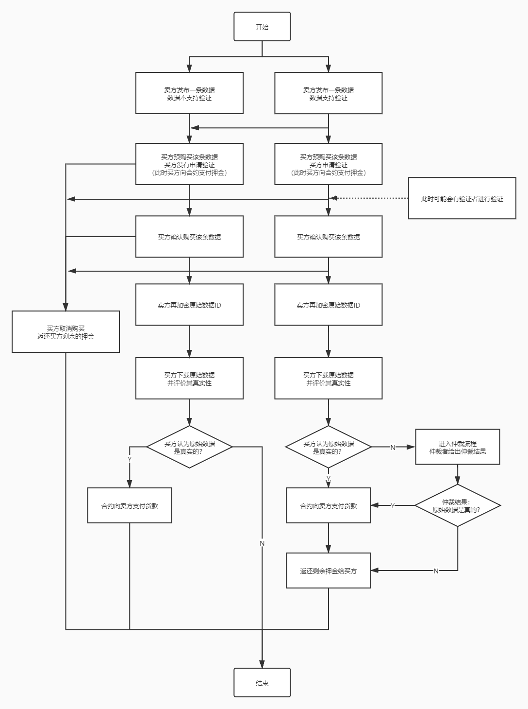

# app使用手册
> 本文主要介绍我们的app具有哪些功能，以及一些使用说明。

app目前支持这些功能：
 - 在链上发布一条数据
 - 购买链上发布的数据
 - 取消购买行为
 - 申请其他人验证一条数据的真实性
 - 验证者验证数据
 - 申请由信誉良好的人对一条数据的真实性进行仲裁
 - 仲裁者仲裁数据  

详见下图：
 

说明：
 - 申请验证之前，需要保证有足够多的验证者（有验证资格的人），app会随机选择两位验证者进行验证、要求至少有三位验证者可供选择。
 - 申请仲裁之前，需要保证有足够多的仲裁者（有仲裁资格的人），app会随机选择一位仲裁者进行仲裁、要求至少有两位仲裁者可供选择。
 - 只有进入验证流程的购买行为才可以申请仲裁，卖方支持验证且买方选择申请验证将进入验证流程。
 - 买方通过数据列表进行的预购买，可以用来表达自己的购买意向以及选择是否申请验证；  
 而在我的购买列表中进行的确认购买，才是真的购买数据并通知卖家使用自己的公钥再加密原始数据ID；  
 并且直到卖家再加密完成之前，当前购买行为都是可以取消的。
 